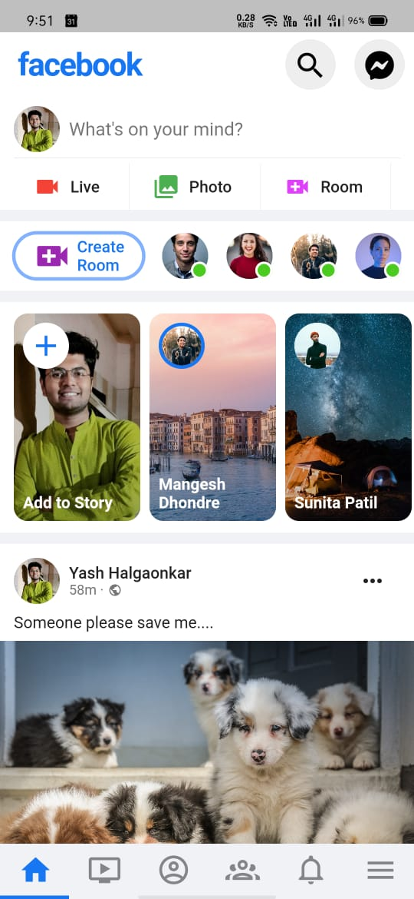

# RelaxBook - Facebook Clone

RelaxBook is a Flutter project that replicates the design and features of Facebook, and it is open for contributions. This project aims to provide a platform for developers to learn and contribute to a real-world Flutter application.

## Features

- **Authentication**: Sign in and sign up functionality using Firebase Authentication.

- **News Feed**: View posts from friends and follow users, like and comment on posts.

- **Profile**: View and edit your profile, including profile picture and bio.

- **Friend Requests**: Send and accept friend requests, manage your friends list.

- **Chat**: Real-time messaging with friends.

- **Notifications**: Stay updated with likes, comments, and friend requests.

- **Explore**: Discover new content and users to follow.

- **Dark Mode**: An option for dark mode for a more comfortable browsing experience.

## Getting Started

To get started with contributing to RelaxBook, follow these steps:

1. **Fork** the repository and **clone** it to your local machine.

2. **Install Flutter and Dart**: Make sure you have Flutter and Dart installed. If not, follow the official Flutter installation guide: https://flutter.dev/docs/get-started/install

3. **Firebase Configuration**: Set up a Firebase project for authentication and real-time database functionality. Add the necessary Firebase configuration to the project.

4. **Run the App**: Run the app locally with `flutter run`.

5. **Pick an Issue**: Check the [issues](https://github.com/your-username/RelaxBook/issues) section for tasks and features to work on.

6. **Create a Branch**: Create a new branch for your feature or bug fix using `git checkout -b your-branch-name`.

7. **Make Changes**: Write your code and make the desired changes.

8. **Test**: Make sure your changes work as expected and do not introduce new issues.

9. **Commit and Push**: Commit your changes and push to your forked repository.

10. **Create a Pull Request**: Create a pull request from your branch to the `main` branch of the original RelaxBook repository.

## Contribution Guidelines

- Follow the coding style and guidelines used in the project.

- Write clear and concise commit messages.

- Comment your code when necessary.

- Be responsive to feedback and communicate with other contributors.

- Test your changes thoroughly before submitting a pull request.

## License

This project is licensed under the MIT License. See the [LICENSE](LICENSE) file for details.

## Acknowledgments

- This project is inspired by the design and features of Facebook.

- Thanks to the Flutter and open-source community for their contributions and support.

Happy coding and contributing to RelaxBook!
